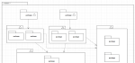
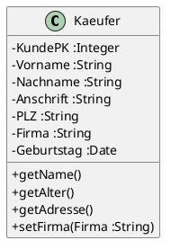
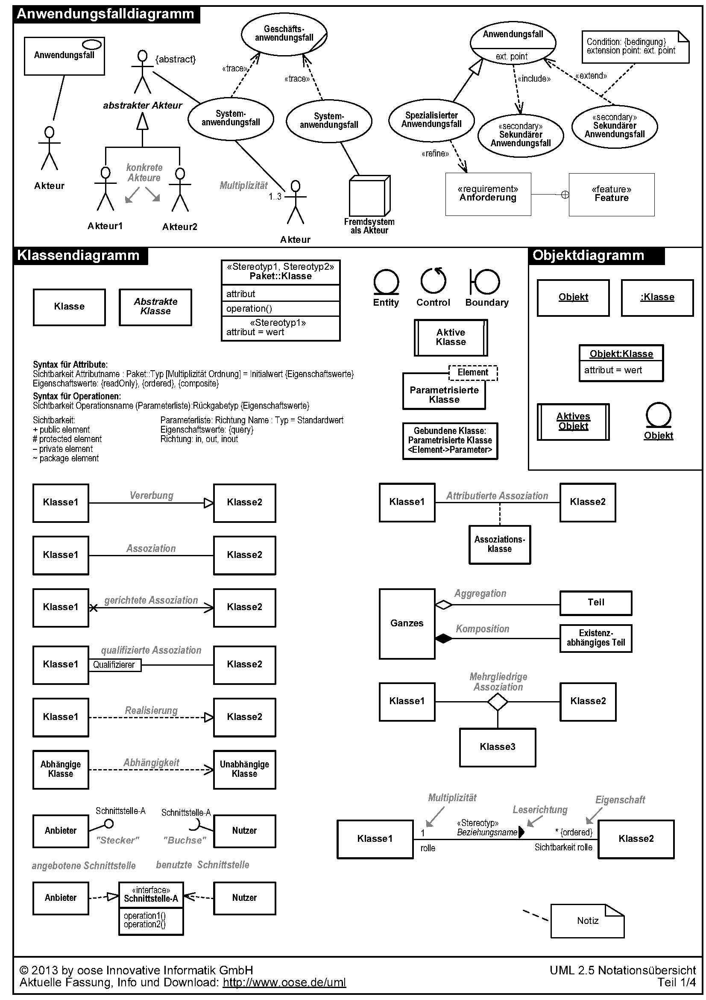
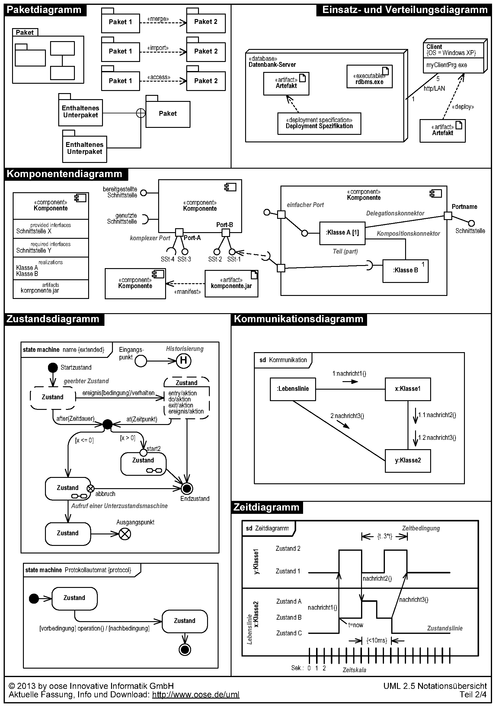
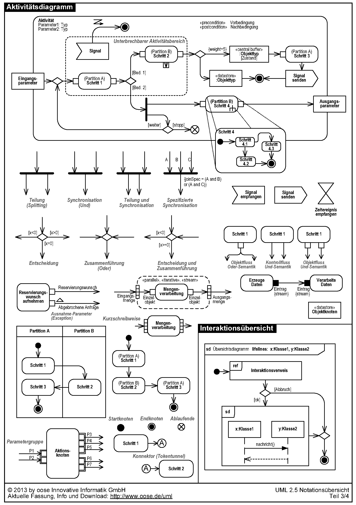
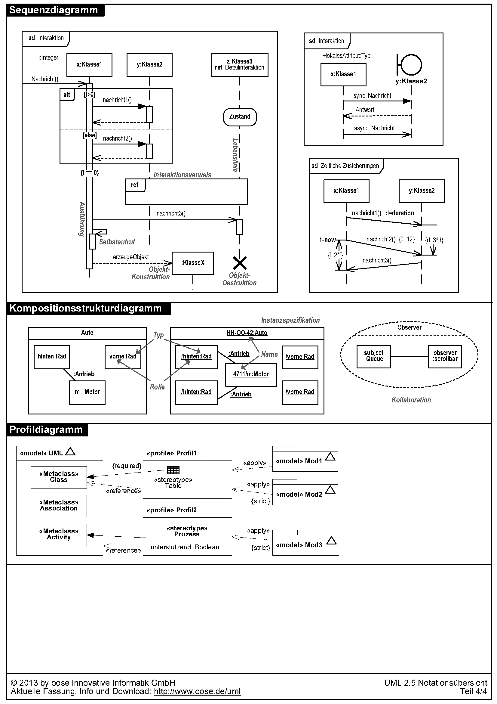

# UML: Unified Modeling Language

In diesem Kapitel finden Sie Informationen und Übungen zu ...

- ... UML-Klassendiagrammen.

---

## Handlungssituation

Die European Automotive SE ist eine Aktiengesellschaft, welche im europäischen Raum als Automobilproduzent tätig ist. Die Produktion ist dabei über mehrere EU-Mitgliedsstaaten verteilt organisiert.

Der Einkauf des Konzerns hat seinen Sitz in Estland. Von dort aus werden die Bestände aller Werke beobachtet und geregelt. Auch kundenspezifische Bauteile werden aus der Einkaufszentrale heraus beschafft.

In Bulgarien und Polen liegen Werke zur Vorproduktion der benötigten Karossiere-Teile bzw. der Innenausstattung.

Die Endmontage wird in Polen durchgeführt. Dazu werden die vorproduzierten Teile angeliefert und durch die eingekauften Fremdbauteile und -gruppen ergänzt.

Während sich die Forschung & Entwicklung sowie die Geschäftsführung in Deutschland befindet, ist die Qualitätssicherung von Fertigprodukten und der After-Sales-Service in Frankreich positioniert.

Die Personalabteilung, Abrechnung und weitere kleinere administrative Abteilungen sind in den Niederlanden angesiedelt.

Erklärtes Ziel der European Automotive SE ist es, moderne Automobilkonzepte in und für Europa herzustellen und damit die Mitgliedsstaaten zu verzahnen. Das Unternehmen wird durch die Europäische Union u.a. finanziell unterstützt und hat Kooperationen mit den in den EU angesiedelten Automobilkonzernen.

Strategisch arbeitet die European Automotive SE an Mobilitätskonzepten, welche nicht zwingend auf den Verkauf von Automobilen basiert. Aktuell befinden sich zwei Elektrofahrzeuge in der Produktion. Ein Kleinlaster für kommunale Aufgaben (bspw. Straßenmeisterei, Parkpflege, handwerkliche Tätigkeiten) sowie ein Kleinbus für den Nahverkehr.

Sie arbeiten in der IT der Forschungsabteilung der European Automotive SE und sind mit Ihrer Gruppe für die Einführung eines neuen Fahrzeugs in die Produktion eingesetzt. Ein Kleinlaster mit Elektro-Antrieb und Brennstoffzelle soll für die Paketauslieferung in der letzten Meile gebaut werden. Dazu ist eine neue Produktionslinie mitsamt allen Prozessen einzurichten. Diverse als Zukunftstechnologien identifizierte Prinzipien sollen im Rahmen dieser Produktionslinie eingesetzt werden, um deren Potenzial herauszufiltern und auf den Prüfstand zu stellen.

---

## UML-Klassendiagramm

Das Klassendiagramm ist eines der wichtigsten Diagramme für die Analyse und das Design von Softwaresystemen. Im Klassendiagramm werden die Klassen des zu entwickelnden Systems und deren Beziehungen untereinander dargestellt. Es ist statisch und zeigt keine zeitabhängigen Abläufe von Operationen. Es gibt einige Analogien zwischen Klassendiagramm und dem im Zusammenhang mit Datenbanken bereits bekannten ERM.

---

### Informationsmaterial M|1: UML-Klassendiagramme

#### Darstellung einer Klasse

Eine Klasse besteht aus drei wesentlichen Teilen:

- dem Klassennamen,
- den Attributen und
- den Methoden.

Attribute haben unterschiedliche Sichtbarkeiten. Sie können privat oder öffentlich sein. Dazu bietet das Klassendiagramm folgende Symbolik:

| Symbol | Bedeutung | Sichtbarkeit |
| :--- | :--- | :--- |
| - | privates Attribute (private) | Ist gegen den Zugriff von außen geschützt und kann nur über entsprechende Methoden angesprochen werden. |
| + | öffentliches Attribut (public) | Kann direkt angesprochen werden und wird nur selten verwendet. |
| # | geschütztes Attribut – spielt bei der Vererbung eine Rolle (protected) | Verhält sich nach außen wie ein privates Attribut. Innerhalb der Vererbungshierarchie aber wie ein öffentliches. Eine Klasse, die von einer anderen erbt, kann auf deren geschützte Attribute zugreifen als wäre es ihre eigenen. |

---

## UML Notationsübersicht

[zum Download](https://www.oose.de/wp-content/uploads/2012/05/UML-Notations%C3%BCbersicht-2.5.pdf)

---

